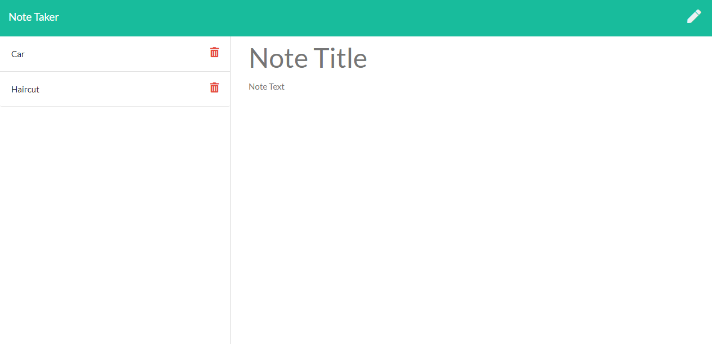

# 📓 [Express_Note_Taker](https://rocky-coast-25606.herokuapp.com/notes) 📓

This app was created to be a user friendly way to keep track of your notes.  Simply type the title and note content into the body of the website and click the save button in the top right corner for the note to be saved.    The save button is the image that looks like an old floppy disk.  The pen button image will create a new now.  All saved notes will be saved on the left hand side of the page by there title.  When you have completed the task or want to remove the note, simply click on the red trash can button and the note will be removed and will not be displayed anymore.  Each note has a unique ID number than is generated by UUID module when the note is created.

This app uses Javascipt, CSS, html, and node to run the app.  The main dependencies are Express, UUID and Path.  The app is deployed on Heroku server and can be ran by clicking the title of this readme.  Enjoy!
